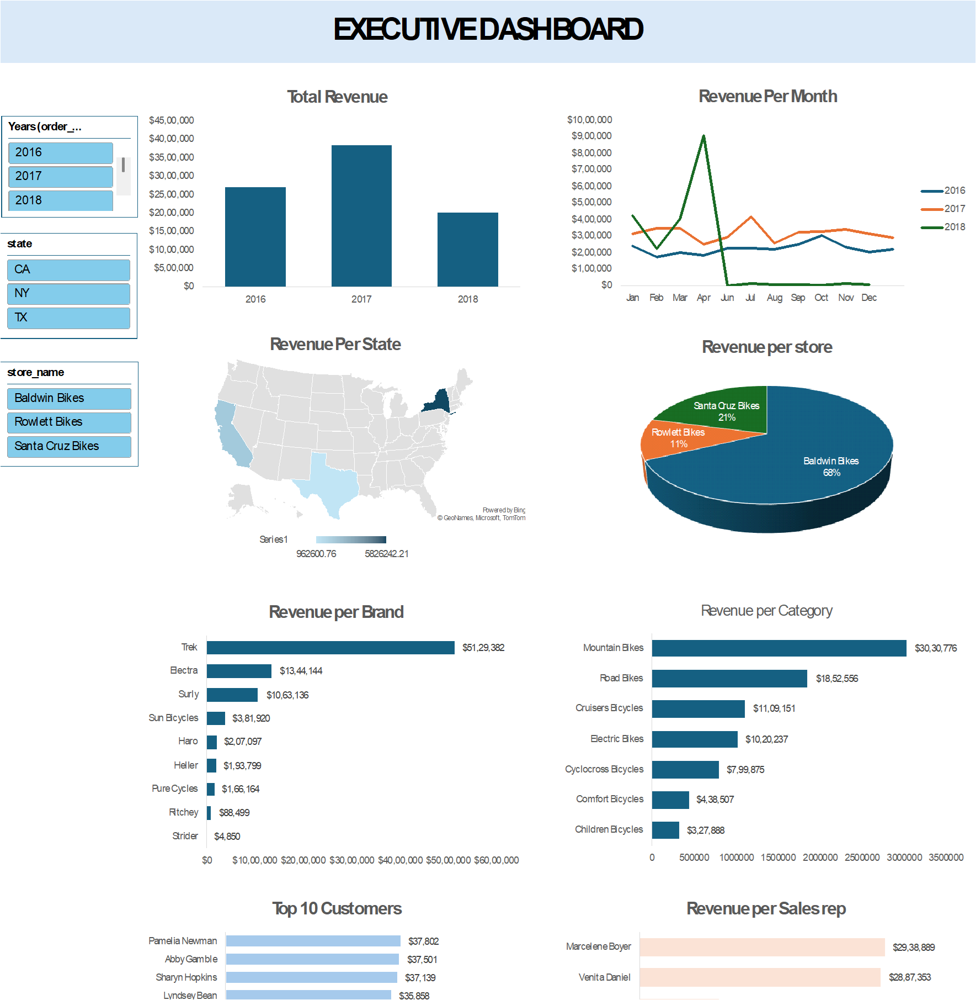

## Revenew_Analysis
A data analytics project using SQL, Excel, and Tableau to analyze BikeStores sales performance, revenue trends, customers, products, stores, and sales representatives.

## Project Overview

This project analyzes BikeStores sales data using SQL, Excel, and Tableau. The objective of the project is to extract and analyze sales information and present meaningful insights through interactive dashboards.

The project demonstrates the complete data analysis workflow, including data extraction using SQL and data visualization using Excel and Tableau.

## Project Objectives

- Analyze overall revenue performance
- Identify revenue trends across years and months
- Analyze revenue by state, store, brand, and product category
- Identify top customers based on revenue
- Compare sales representative performance
- Build interactive dashboards for data visualization

## Tools Used

- SQL Server Management Studio (SSMS)
- Microsoft SQL
- Microsoft Excel
- Tableau
- GitHub

## SQL Data Analysis

SQL was used to extract and combine data from multiple tables in the BikeStores database.

The analysis uses the following tables:

- "sales.orders"
- "sales.customers"
- "sales.order_items"
- "production.products"
- "production.categories"
- "production.brands"
- "sales.stores"
- "sales.staffs"

The SQL query uses "JOIN" operations to combine data from multiple tables and calculate important sales metrics.

## Key Data Extracted

- Order ID
- Customer Name
- Customer City and State
- Order Date
- Total Units Sold
- Revenue
- Product Name
- Category
- Brand
- Store Name
- Sales Representative

## SQL Query

USE BikeStores;

SELECT
    ord.order_id,
    CONCAT(cus.first_name, ' ', cus.last_name) AS customers,
    cus.city,
    cus.state,
    ord.order_date,
    SUM(ite.quantity) AS total_units,
    SUM(ite.quantity * ite.list_price) AS revenue,
    pro.product_name,
    cat.category_name,
    bra.brand_name,
    sto.store_name,
    CONCAT(sta.first_name, ' ', sta.last_name) AS sales_rep

FROM sales.orders ord

JOIN sales.customers cus
    ON ord.customer_id = cus.customer_id

JOIN sales.order_items ite
    ON ord.order_id = ite.order_id

JOIN production.products pro
    ON ite.product_id = pro.product_id

JOIN production.categories cat
    ON pro.category_id = cat.category_id

JOIN production.brands bra
    ON pro.brand_id = bra.brand_id

JOIN sales.stores sto
    ON ord.store_id = sto.store_id

JOIN sales.staffs sta
    ON ord.staff_id = sta.staff_id

GROUP BY
    ord.order_id,
    CONCAT(cus.first_name, ' ', cus.last_name),
    cus.city,
    cus.state,
    ord.order_date,
    pro.product_name,
    cat.category_name,
    bra.brand_name,
    sto.store_name,
    CONCAT(sta.first_name, ' ', sta.last_name);

## Excel Dashboard

The extracted data was exported to Microsoft Excel for further analysis and visualization.

The Excel dashboard analyzes:

- Revenue by year
- Revenue by month
- Revenue by state
- Revenue by store
- Revenue by brand
- Revenue by category
- Top 10 customers
- Revenue by sales representative

The Excel dashboard was created to analyze sales performance and present key insights using charts and interactive elements.

## Tableau Dashboard

A Tableau dashboard was created to provide interactive visualizations of BikeStores sales performance.

The dashboard analyzes revenue across:

- Time periods
- States
- Stores
- Product brands
- Product categories
- Customers
- Sales representatives

## Project Workflow

1. Extracted and combined data from the BikeStores database using SQL.
2. Used SQL JOIN operations to combine multiple tables.
3. Calculated total units sold and revenue.
4. Exported the processed data for visualization.
5. Created an interactive dashboard in Microsoft Excel.
6. Created a Tableau dashboard for additional data visualization and analysis.

## Business Insights

- Revenue performance varied across different years and months.
- The analysis identified differences in revenue contribution across states and stores.
- Product brands and categories showed different levels of revenue contribution.
- The Top 10 Customers analysis identified customers contributing significantly to overall revenue.
- Revenue performance varied across sales representatives.
- Interactive Excel and Tableau dashboards made it easier to explore revenue performance across different business dimensions.

## Skills Demonstrated

- SQL data extraction and transformation
- SQL JOINs
- Data Extraction
- Data Aggregation
- Data Analysis
- Microsoft Excel
- Tableau
- Data Visualization
- Dashboard Creation
- KPI analysis
- Business insight generation

## Project files 
- 'bikerstore project 1.xlsx' - Excel Analysis
- 'bikestores revenue analysis.twb' - Tableau Dashboard

## Conclusion

This project demonstrates an end-to-end data analytics workflow, from extracting and combining data using SQL to analyzing the data in Excel and creating interactive visualizations in Tableau. The dashboards provide a consolidated view of revenue performance across customers, products, locations, stores, and sales representatives.
